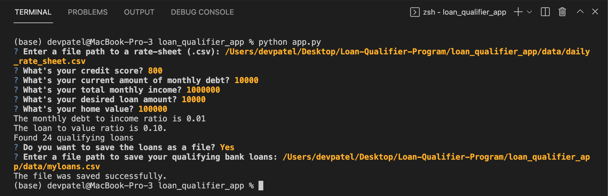
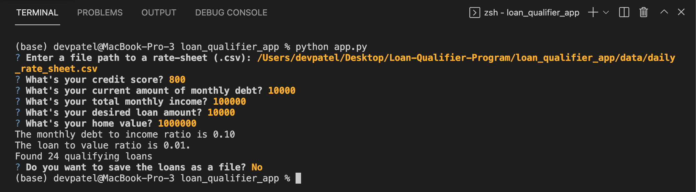

# Loan Qualifier Program 

This program will prompt the User for certian inputs and return all qualifying loans, if any, in a csv file.  

---

## Technologies

This projects leverages Python libraries for certain User input commands. 
'''
import sys
import fire
import questionary
from pathlib import Path
'''

---

## Installation Guide
Use 'git clone' followed by the link below. 

https://github.com/dev8125/Loan-Qualifier-Program.git

---

## Usage

Example 1: When the User would like to save their loans. 

Example 2: When the User would not like to save their loans. 

---

## Contributors

Starter Code was provided by UCB Fintech Program and all changes have been made by Dev Patel. 

---

## License

This is a non-licensed project. 
